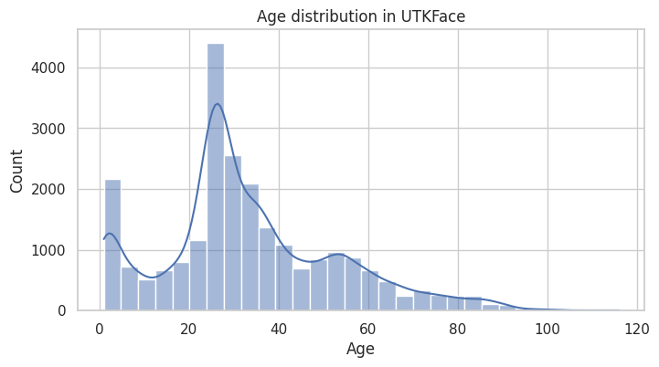

# UTKFace-LeNet-age-regression

Простой baseline-проект по оценке возраста по фотографиям лиц с помощью сверточной нейросети (PyTorch) на датасете UTKFace.

## Описание проекта

- Задача: предсказать числовой возраст человека по изображению его лица (регрессия).
- Датасет: [UTKFace](https://www.kaggle.com/datasets/jangedoo/utkface-new) — около 23k изображений лиц с разметкой возраста, пола и расы (используется только возраст).
- Цель: научить модель LeNet определять возраст людей по фотографиям лица и выявить недостатки метода и точки роста (т.е. baseline для более крупного проекта).

Ноутбук с полным пайплайном:  
`Age_detection_LeNet.ipynb`

## Результаты

- Наивный baseline (предсказание медианного возраста по train): MAE ≈ 15 лет на тесте.
- Модель LeNet-подобной CNN:
  - Test MAE: **6,12** лет.
  - Test MSE: ~77,94.

Это показывает, что даже простая сверточная модель уже существенно улучшает качество по сравнению с наивным предсказанием и даёт разумную стартовую планку для дальнейших экспериментов.

- 
- 
- 
- 
